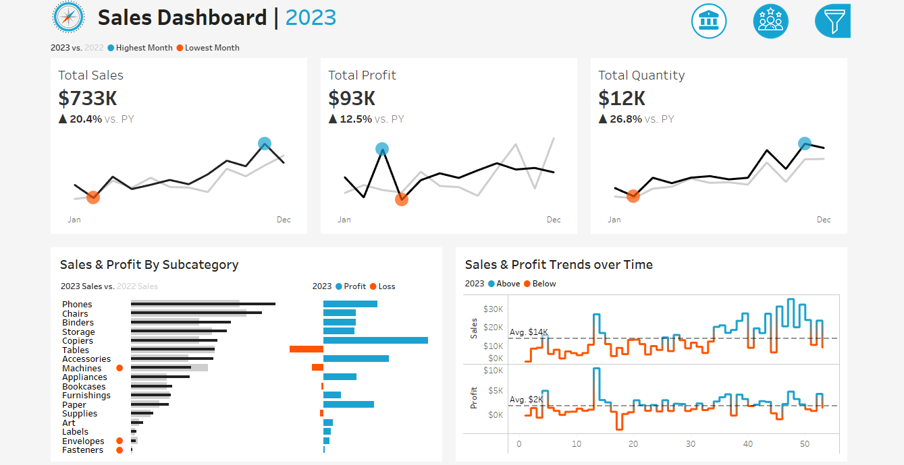
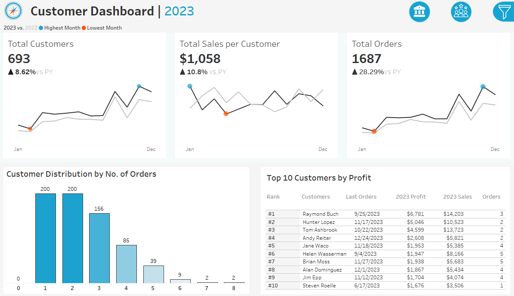

# 📊 Segment-Wise Customer & Revenue Insights Dashboard – Tableau

## 📌 Project Objective  
Designed and developed a fully interactive Tableau dashboard to analyze sales and customer trends across time, product subcategories, and customer segments — helping stakeholders understand business performance year-over-year.

## 🛠 Tools & Technologies  
- Tableau Public  
- Excel (for structured data source)  
- Calculated fields, LOD expressions, filters, table calculations

## 🧩 Dataset Overview  
Built a relational data model by connecting **four separate tables**:

- `Orders`: Fact table with Sales, Profit, Quantity, Dates, and IDs  
- `Customers`: Dimension table with Customer IDs and Names  
- `Products`: Dimension table with Product IDs, Names, Categories, and Subcategories  
- `Locations`: Dimension table with City, State, Region, and Postal Code  

Relationships were created using common keys:
- Customer ID → Orders
- Product ID → Orders
- Postal Code → Orders

Data types were cleaned and verified (e.g., dates as date type, numeric fields as measures). Geographical roles were assigned to appropriate fields (e.g., Region, State).

---

## 📊 Key Metrics & Visualizations  

### 🔹 Sales KPI Trend Charts (2022 vs 2023)  
- Line + circle chart showing monthly **Total Sales**  
- Highlights highest and lowest sales months with % change  
- **🟠 Lowest:** February 2023 ($20K) ↓ -11.65% vs 2022  
- **🔵 Highest:** November 2023 ($118K) ↑ +49.16% vs 2022

### 🔹 Profit KPI Trend Charts  
- Similar format for **Total Profit** by month  
- **🟠 Lowest:** April 2023 ↓ -68.66%  
- **🔵 Highest:** March 2023 ↑ +308.42%

### 🔹 Quantity KPI Trend Charts  
- Monthly **Total Quantity Sold** comparison  
- **🟠 Lowest:** February 2023 ↑ +18.63%  
- **🔵 Highest:** November 2023 ↑ +30.87%

> ✅ Only the **Select Year** filter is used in all KPI charts.

---

### 🔹 Product Subcategory Comparison  
- Clustered bar chart comparing **Sales 2023 vs 2022** and **Profit 2023**  
- Highlights subcategories where 2023 underperformed 2022  
- 🔻 **Machines** had -22.11% lower sales in 2023  
- 🟥 **Tables**, **Machines**, **Bookcases**, and **Supplies** had negative profits

---

### 🔹 Weekly Trends – Sales & Profit  
- Line charts for **week-wise trends** in Sales and Profit  
- Conditional color coding based on average  
- 📉 Lowest Sales: Week 22 ($4K) | 📈 Highest: Week 48 ($36K)  
- 📉 Lowest Profit: Week 17 (-$3K) | 📈 Highest: Week 13 ($9K)

---

## 👥 Customer Dashboard Visuals  

### 🔹 Customers KPI Trend  
- Monthly count of **unique customers**  
- **🟠 Lowest:** February 2023 (53) ↑ +26.19%  
- **🔵 Highest:** November 2023 (216) ↑ +30.91%

### 🔹 Sales per Customer KPI  
- Monthly average **Sales per unique customer**  
- **🟠 Lowest:** April 2023 ($335) ↓ -28.2%  
- **🔵 Highest:** January 2023 ($656) ↑ +62.8%

### 🔹 Orders KPI  
- Monthly count of total **Orders**  
- **🟠 Lowest:** February 2023 (45) ↑ +28.3%  
- **🔵 Highest:** November 2023 (183) ↑ +28.3%

> ⚠️ Issue: February and November 2023 initially showed same value for orders due to axis misalignment — now fixed using synchronized dual-axis.

---

### 🔹 Customer Distribution by No. of Orders  
- Bar chart showing how many customers placed 1, 2, 3… orders  
- Helps assess **loyalty and engagement**  
- 1 customer placed **8 orders**  
- 2 customers placed **7 orders**  
- Most customers placed **1 or 2 orders**

---

### 🔹 Top 10 Customers by Profit  
- Indexed table showing **Top 10 customers** (2023) by Profit  
- Includes: Name, Last Order Date, Profit, Sales, and No. of Orders  
- 🏆 **Top 1:** Raymond Buch → $6,781 profit from 3 orders  
- 🥈 **Top 2:** Hunter Lopez → $5,046 profit from 2 orders

---

## 🧠 Insights & Business Value  
- 📈 Strong growth in KPIs across 2023 compared to 2022  
- 📉 Certain subcategories underperformed in both sales and profit  
- 📆 November showed peak activity across all sales, customer, and order metrics  
- 🧍 Top 10 customers contributed significantly to profits  
- 📊 Weekly and monthly trends help in **sales planning**, **staff allocation**, and **product stocking**

---

## 📂 Files Included  
- `Live Project` –  https://public.tableau.com/app/profile/elizabeth.joycee/viz/SalesandCustomerDashboards_17477483609220/CustomerDashboard
- 📸 Dashboard Screenshot:  
   |  |

---

## 🔗 Live Repository  
Explore the full project:  
👉 [GitHub Repository – Tableau Sales & Customer Dashboard](https://github.com/elizabethjoyceg/customer-sales-tableau)

---

This project demonstrates skills in **data modeling, Tableau visualization, KPI tracking, and business insight generation**, aligned with expectations from roles at **Google, Microsoft, Razorpay, Mastercard**, and other product-driven companies.
